# Modeling

The delta-model trainer compares three classifiers on the same geographic
splits: a tabular MLP, a random-initialized raster ConvGRU, and a raster ConvGRU
whose frame encoder starts from masked NO2 pretraining.

## Contract

| Component | Current choice |
|---|---|
| Target | Stored `delta_category` |
| Classes | `decrease`, `steady`, `increase`, mapped to 0, 1, and 2 |
| Raster sequence | Five completed `4 x 24 x 24` frames |
| Raster channels | NO2, 2 m temperature, eastward wind, northward wind |
| Tabular input | Ten standardized plant, activity, and cyclic-time features |
| Loss | Unweighted three-class cross-entropy |
| Checkpoint selection | Lowest validation cross-entropy for each model |
| Primary result | Masked-pretrained raster classifier |

Dataset generation supplies the class label. The loader does not derive a new
class from a continuous target. See [dataset_design.md](dataset_design.md) for
the thresholds and temporal alignment.

## Normalization and NO2 completion

Training loads the configured masked-model checkpoint before it builds the
delta datasets. The checkpoint supplies the raster normalization statistics:

| Channels | Center | Scale |
|---|---|---|
| NO2 | Median | `IQR / 1.349` |
| Temperature and wind | Mean | Population standard deviation |

The loader normalizes values, clips them to `[-8, 8]`, fills numeric gaps with
zero, and appends `no2_mask` for reconstruction. The masked autoencoder predicts
NO2 at missing pixels and preserves observed values. Training materializes the
completed physical channels as split-specific `.npy` files under job-local
`/tmp`.

The raster classifiers consume the completed arrays without a validity mask.
Their input shape is `5 x 4 x 24 x 24`, and their NO2 stems use ordinary
convolutions.

The tabular loader fits means and standard deviations on the delta training
split. Its ten inputs are major-city distance, coal and natural-gas unit counts,
nameplate capacity, prior-quarter same-hour heat input and generation, plus sine
and cosine encodings of local solar hour and day of year.

## Models

### Tabular baseline

The 1,027-parameter MLP uses a 32-value hidden layer, a 16-value embedding, and
three output logits. It receives no raster data.

### Raster classifiers

Both 700,803-parameter raster models share one architecture. A frame encoder
maps each completed image to a `64 x 6 x 6` feature map. A 96-channel ConvGRU
processes the five maps in time order. Global average and maximum pooling feed a
128-value projection and a 128-value classification head with three logits.

The random-initialized model trains the full network from its seeded initial
weights. The pretrained model copies the masked encoder's weather, fusion, and
residual weights. It maps each partial-convolution NO2 kernel and bias to the
matching ordinary convolution and discards the fixed mask-counting kernels.

Both raster models use the same imputed arrays. Their comparison measures the
combined effect of encoder initialization and the transfer fine-tuning schedule.
The pretrained encoder stays frozen for the first two epochs, then trains at one
tenth of the base learning rate. Other pretrained-model parameters use the base
rate.

```mermaid
flowchart LR
    subgraph Sequence[Five completed 24 by 24 frames]
        Frame[NO2, temperature,<br/>eastward wind, northward wind]
    end

    subgraph Shared[Shared frame encoder applied at each timestep]
        NO2Stem[NO2 stem<br/>5 by 5 and 3 by 3 convolutions<br/>16 channels]
        WeatherStem[Weather stem<br/>5 by 5 convolution<br/>16 channels]
        Join[Concatenate and 1 by 1 fusion<br/>32 by 24 by 24]
        Spatial[Residual spatial encoder<br/>32 by 24 by 24<br/>to 64 by 6 by 6]
        NO2Stem --> Join
        WeatherStem --> Join
        Join --> Spatial
    end

    Frame -->|NO2| NO2Stem
    Frame -->|weather| WeatherStem
    Spatial --> Encoded[Five feature maps<br/>64 by 6 by 6]
    Encoded --> GRU[ConvGRU over time<br/>96 by 6 by 6 hidden state]
    GRU --> Average[Global average pool<br/>96 values]
    GRU --> Maximum[Global maximum pool<br/>96 values]
    Average --> PoolJoin[Concatenate<br/>192 values]
    Maximum --> PoolJoin
    PoolJoin --> Projection[Linear projection<br/>128 values]
    Projection --> Head[128-value classification head]
    Head --> Logits[Three logits<br/>decrease, steady, increase]

    Pretrained[Masked-model encoder weights] -.->|initialize; freeze 2 epochs| Shared
    Random[Seeded random weights] -.->|comparison model| Shared
```



## Optimization

All three models use unweighted cross-entropy. Stratification balances classes
before raster quality control, and run metadata records the retained count for
each class and split.

The trainer uses AdamW, gradient clipping, validation-loss scheduling, CUDA
mixed precision, and early stopping. Defaults allow 100 raster epochs, 75 MLP
epochs, and 12 epochs without validation improvement. The maintained Slurm
launcher uses a batch size of 128, a raster learning rate of `3e-4`, 30% head
dropout, and seed 42.

Run the production workflow with:

```bash
sbatch scripts/slurm/train_model.sh
```

Direct module execution also requires `--completed-raster-dir` under `/tmp` and
a valid `--pretrained-encoder-weights` path.

## Evaluation and artifacts

Each model reports accuracy, balanced accuracy, macro F1, one-vs-rest macro
AUROC, class counts, per-class recall, and a three-class confusion matrix for
train, validation, and test.

The run directory contains:

- best checkpoints for the MLP and both raster models;
- `run_config.json`, normalization statistics, and loss histories;
- row-level class logits and probabilities for each model and split;
- loss curves, model-comparison plots, and row-normalized test confusion
  matrices.

The trainer selects checkpoints with validation cross-entropy. Test labels
contribute only to the final reports.
