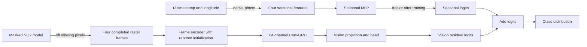

# Modeling

The delta-model trainer compares a seasonal classifier with a vision-seasonal
classifier on the same geographic splits. The masked NO2 model fills missing
raster pixels before classifier training. Its encoder does not initialize the
vision model.

## Contract

| Component | Current choice |
|---|---|
| Target | Stored `delta_category` |
| Classes | `decrease`, `steady`, `increase`, mapped to 0, 1, and 2 |
| Raster sequence | Four completed `4 x 24 x 24` frames |
| Raster channels | NO2, 2 m temperature, eastward wind, northward wind |
| Seasonal input | Local-solar-hour sine/cosine and day-of-year sine/cosine |
| Loss | Unweighted three-class cross-entropy |
| Prediction | Softmax distribution over the three classes |
| Checkpoint selection | Lowest validation cross-entropy for each model |
| Primary result | Vision-seasonal late-fusion classifier |

Dataset generation supplies the class label. The loader consumes that label
without recreating its construction.

## Seasonal features

The loader derives all four seasonal features from `t3_timestamp`, the final
scan aligned with the target. It shifts the UTC timestamp by `longitude / 15`
hours to obtain local solar time. Daily phase includes hour, minute, second, and
microsecond. Annual phase uses the resulting local-solar day of year plus the
fractional day and accounts for leap years. Training-split means and standard
deviations normalize the four derived values.

The seasonal model receives these inputs:

- `local_solar_hour_sin` and `local_solar_hour_cos`;
- `day_of_year_sin` and `day_of_year_cos`.

AOI score, city distance, unit counts, heat input, generation, latitude, and
longitude do not enter either classifier. The test-strata report uses selected
AOI characteristics after inference.

## Raster normalization and completion

Training loads the configured masked-model checkpoint before it builds the
classifier datasets. The checkpoint supplies raster normalization statistics:

| Channels | Center | Scale |
|---|---|---|
| NO2 | Median | `IQR / 1.349` |
| Temperature and wind | Mean | Population standard deviation |

The loader normalizes values, clips them to `[-8, 8]`, fills numeric gaps with
zero, and appends `no2_mask` for reconstruction. The masked autoencoder predicts
NO2 at missing pixels and preserves observed values. Training writes the four
completed physical channels to split-specific memory-mapped arrays under the
job-local `/tmp` directory.

Classifier training starts after completion finishes. Neither classifier sees
the validity mask, and the vision encoder starts from random weights.

## Models

### Seasonal classifier

The 291-parameter seasonal MLP maps four inputs through 16-value and 8-value
hidden representations before producing three logits. Training selects its
lowest-validation-loss checkpoint.

### Vision-seasonal classifier

The trainer copies the selected seasonal MLP into the combined model and freezes
all of its parameters. A frame encoder maps each completed raster to a
`64 x 6 x 6` feature map. A 64-channel ConvGRU processes the four maps in time
order. Global average and maximum pooling feed a 64-value projection and a
64-value classification head.

The vision branch has 477,923 trainable parameters. It produces three residual
logits, which the model adds to the frozen seasonal logits. The trainer
zero-initializes the final residual layer, so vision training starts from the
selected seasonal prediction. Subtracting the two models' accuracy shows the
effect of adding raster evidence to that prediction.



## Optimization

Both classifiers use AdamW, gradient clipping, validation-loss scheduling, CUDA
mixed precision, and early stopping. Defaults allow 75 seasonal epochs and 100
vision epochs. Training stops after 15 epochs without a lower validation loss;
the scheduler halves the learning rate after 10 such epochs. The maintained
Slurm launcher uses a batch size of 128, a vision learning rate of `3e-4`, a
64-value head, 30% dropout, and seed 42.

Run the production workflow with:

```bash
sbatch scripts/slurm/train_model.sh
```

Direct module execution requires `--completed-raster-dir` under `/tmp` and
a valid `--pretrained-masked-model-weights` path.

## Evaluation and artifacts

Each model reports accuracy, balanced accuracy, macro F1, one-vs-rest macro
AUROC, class counts, per-class recall, and a three-class confusion matrix in
`results.json`.

The trainer produces three summary figures:

- `split_class_accuracy.png` shows overall accuracy by split and per-class
  recall within each split;
- `training_curves.png` shows train and validation loss for both models;
- `test_strata_accuracy.png` compares test accuracy across low, middle, and
  high AOI-characteristic and record-level raster-quality groups.

The strata figure covers AOI plume score, total unit count, average heat input,
and raster quality. The trainer assigns the AOI characteristics at the
unique-AOI level. It computes record-level raster quality by equally combining
the percentile ranks of low mean cloud fraction and high good-quality-pixel
fraction. Labels report vision-seasonal accuracy minus seasonal accuracy.
`test_strata_accuracy.csv` stores the plotted counts, stratification unit, value
ranges, accuracies, and differences.

The run directory contains both best checkpoints, preprocessing state,
run configuration, and row-level predictions for each model and split.
