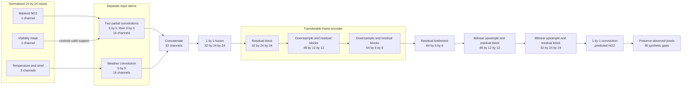

# Modeling

The masked model learns a spatial NO2 representation that can support two uses:
missing-pixel imputation and initialization of the delta model's frame encoder.
It receives visible NO2, temperature, wind, and a visibility mask, then predicts
one complete NO2 raster. See [modeling_result.md](modeling_result.md) for the
latest training and held-out reconstruction results.

## Architecture philosophy

Separate stems let the network treat NO2 missingness as a data-quality problem
without applying the same machinery to complete weather fields. The NO2 stem
uses partial convolutions, which exclude hidden pixels and rescale each kernel
for its valid support. A conventional weather stem processes temperature and
wind. A 1 by 1 layer fuses both 16-channel outputs before the residual encoder.

The encoder matches the delta model's single-frame stack:

| Stage | Output |
|---|---|
| NO2 partial-convolution stem | 16 by 24 by 24 |
| Weather stem | 16 by 24 by 24 |
| Fusion layer | 32 by 24 by 24 |
| Residual encoder | 64 by 6 by 6 |

The decoder uses a 64-channel residual bottleneck, two bilinear upsampling
stages with 48 and 32 channels, and a 1 by 1 NO2 output layer. It has no encoder
skip connections. Skip paths would improve local reconstruction while giving
the decoder a route around the latent representation. The compact decoder puts
more pressure on the 64 by 6 by 6 encoder output. The full model has 394,209
trainable parameters, including 243,680 in the encoder.



## Objective

The model minimizes normalized L1 error on synthetic gaps:

```text
sum(abs(prediction - target) * loss_mask) / sum(loss_mask)
```

Visible pixels do not affect the loss. L1 limits the influence of retrieval
outliers, but it may smooth plume peaks. A masked-MSE comparison can test that
tradeoff after the baseline. The model reconstructs NO2 alone because smooth
weather targets could dominate the shared objective without improving plume
features.

At inference, the imputer preserves observed NO2 and inserts predictions at mask
gaps.

## Transfer to the delta model

The masked and delta encoders share channel counts, layer shapes, fusion, and
residual blocks. The transfer copies weather, fusion, and residual weights. It
maps each partial-convolution kernel and bias onto the matching conventional NO2
convolution and discards the fixed mask-counting kernel.

This mapping provides an initialization rather than mathematical equivalence.
Partial convolution rescales incomplete neighborhoods and image borders, while
standard convolution processes the completed raster without that correction.
Fine-tuning lets the delta encoder adapt to the change. Keeping partial
convolution in the delta model would preserve the pretrained operation, but it
would ignore imputed values when given the original validity mask.

The small decoder and masked-only loss direct training pressure through the
encoder. Reconstruction metrics support debugging. Downstream validation
determines whether the encoder learned useful plume features.
