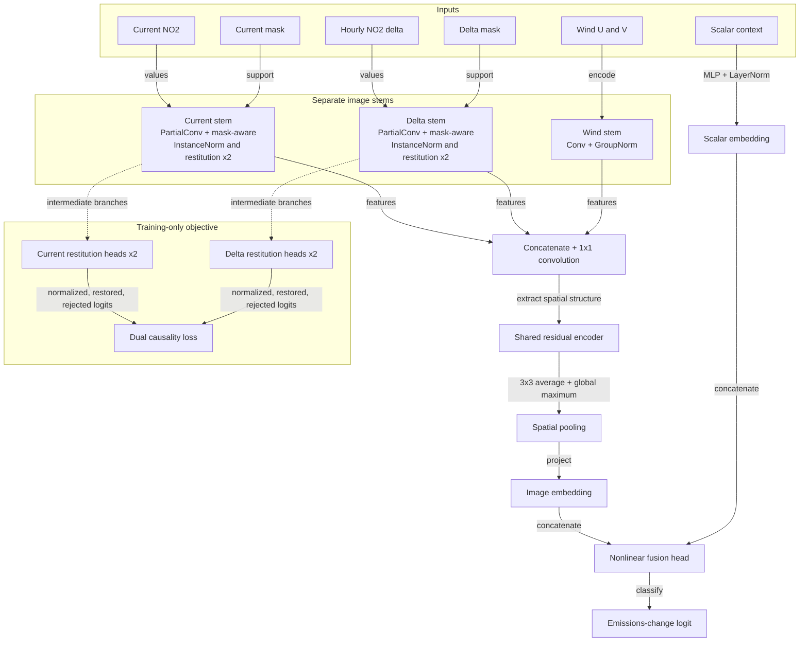

# Modeling

The binary baseline classifies hourly power-plant NOx changes from paired TEMPO
observations.

## Baseline at a glance

| Component | Choice |
|---|---|
| Target | Sign of hourly NOx change outside a 100 lb deadband |
| Image input | Current NO2, hourly NO2 delta, wind U/V, and two validity masks |
| Context input | Plant attributes, prior-quarter activity, weather, time, and paired flux change |
| Split | Geographic AOI clusters, approximately 70/15/15 |
| Image encoder | Separate NO2 restitution stems plus a shared residual CNN |
| Fusion | Image and scalar embeddings before a nonlinear head |
| Selection metric | Validation log loss |
| Final metrics | ROC AUC and log loss across seeds, with subgroup results |

## Prediction target

- Apply the fixed symmetric 100 lb `DELTA_THRESHOLD` cutoff on
  `abs(delta_nox_mass)`.
- Use the same cutoff for train, validation, test, and inference.
- Remove records inside the closed deadband.
- Label negative changes as 0 and positive changes as 1.
- Balance each split to equal label counts after raster QC.
- Preserve raw `delta_nox_mass` for reporting, never as an input.

## Inputs and leakage policy

Each sample carries four aligned 48 by 48 raster channels and scalar context.

Scalar inputs:

- coal and natural-gas unit counts;
- total generator nameplate capacity;
- previous-quarter average heat input and power generation;
- coincident HRRR 2 m temperature and boundary-layer height;
- current-minus-previous flux normalized by absolute prior-quarter mean NOx;
- sine/cosine encodings of local mean solar hour and day of year.

Leakage controls:

| Excluded | Reason |
|---|---|
| Raw coordinates, AOI IDs | Prevent geographic memorization; longitude only converts UTC to local solar hour |
| Current emissions | Direct target leakage |
| Previous-quarter average NOx | Defines the relative-change filter and can identify plant operating regimes |
| `prev_qtr_rel_delta` | Contains target magnitude and is used only for stratification |
| Plume score, raster-quality scores | Diagnostics extracted from the response image |
| Current and previous flux levels, ratio, and confidence | Retained as diagnostics; the normalized paired difference is the model input |

Coverage stays available for sliced evaluation but is not a model input.

### Feature transformations

Every scalar enters raw, then gets standardized with the training-split mean and
standard deviation. Validation, test, and inference reuse those statistics.

| Transform | Features |
|---|---|
| None | all scalar inputs |
| Sine and cosine | Local mean solar hour, day of year |

Local mean solar hour is `(UTC hour + longitude / 15) mod 24`. This keeps solar
time continuous across civil-time boundaries and daylight-saving changes. Sine
and cosine keep hour 23 adjacent to hour 0.

No feature carries a `log1p` transform. Measurements on the first generated
training split rejected it, split by feature:

| Feature | Raw skew | `log1p` skew | Tail share raw | Tail share `log1p` |
|---|---|---|---|---|
| `avg_heat_input` | 0.378 | -0.673 | 0.032 | 0.041 |
| `total_nameplate_capacity_mw` | 0.789 | -0.643 | 0.038 | 0.044 |
| `avg_pwr_gen` | 0.062 | -1.009 | 0.027 | 0.046 |
| `boundary_layer_height_m` | 1.401 | -0.875 | 0.058 | 0.051 |

Tail share is the fraction of total absolute deviation from the median held by
the top 1 percent of records. Only `boundary_layer_height_m` improves on both
measures, and a logistic probe on the tabular features moved validation AUC by
less than 0.005 across every combination tested. Nothing justified the added
distortion, so the transform is gone.

## Image representation and normalization

Four numeric channels and two masks reach the model:

1. smoothed and source-relative upwind-normalized current NO2 on finite native support;
2. current-minus-previous smoothed and upwind-normalized NO2 on paired support;
3. geographic eastward wind aligned from the native HRRR grid;
4. geographic northward wind aligned from the native HRRR grid;
5. independent binary validity masks for current and hourly-delta NO2.

Every statistic comes from training pixels alone:

| Channels | Center | Scale |
|---|---|---|
| current NO2, hourly delta NO2 | median of finite pixels | `IQR / 1.349` |
| wind u, wind v | mean of finite pixels | population standard deviation |

```text
normalized[channel] =
    (raster[channel] - train_center[channel]) / train_scale[channel]
```

- Clip all four numeric channels to `[-8, 8]` and replace invalid normalized
  values with zero only when loading the model input.
- Fit every channel on its finite training pixels.
- Reuse the frozen training statistics for validation, test, and inference.

The two masks remain binary and unscaled. A separate two-layer partial-
convolution stem consumes each NO2 value-mask pair. The resulting features join
the dense wind stem before the shared residual encoder.

Two design notes:

- Robust linear scaling limits outlier influence without compressing the whole
  NO2 distribution.
- Per-image normalization stays unsuitable because absolute enhancement
  magnitude carries part of the emissions signal.

Run outputs store centers, scales, and valid counts in
`normalization_stats.json`; `run_config.json` stores clipped-pixel fractions.

Exact quartiles come from temporary node-local arrays, so the fit never builds
an in-memory pixel archive.

## Network

A compact residual CNN plus an MLP scalar branch:



- Residual stages reduce 48 by 48 images to a 6 by 6 feature map.
- A 3 by 3 adaptive average pool retains coarse plume location.
- A global maximum pool preserves localized enhancements that an average
  dilutes.
- The current and delta NO2 stems use separate mask-aware style normalization
  and restitution modules. Each module applies per-channel InstanceNorm, learns
  channel gates with a 12-to-4-to-12 MLP, and restores the selected feature
  residual before the streams join the wind features. Training-only auxiliary
  heads apply the dual causality objective from
  [Jin et al. (2020)](https://openaccess.thecvf.com/content_CVPR_2020/html/Jin_Style_Normalization_and_Restitution_for_Generalizable_Person_Re-Identification_CVPR_2020_paper.html).
- The fused image embedding joins the scalar embedding for one classification
  logit.

Normalization choices:

- Mask-aware InstanceNorm with learned restitution in the current and delta NO2
  stems. GroupNorm remains in the wind stem and shared image encoder because it
  avoids batch-level statistics when memory pressure forces small batches. See
  the [Group Normalization paper](https://arxiv.org/abs/1803.08494).
- LayerNorm in the MLP projections.

The DenseNet alternative is gone. It duplicated an obsolete input signature and
training never selected it.

The baseline applies no rotation or flip. Alignment rotates HRRR grid-relative
wind to geographic east and north, so any later spatial augmentation must
transform the wind vector values along with the raster coordinates.

## Optimization and I/O

Training uses:

- AdamW;
- unweighted binary cross-entropy with logits;
- gradient clipping and mixed precision on CUDA;
- validation-loss scheduling;
- early stopping.

Where settings live:

| File | Owns |
|---|---|
| `config.py` | Shared data contract: paths, raster keys and channels, image clipping, input-feature definitions |
| `modeling/train.py` | Training defaults |
| `modeling/resnet.py` | Architecture defaults |

Training CLI flags expose the last two, which keeps preprocessing and collection
code independent of any single run while each run still records its resolved
settings.

CUDA runs use automatic mixed precision for convolutions and linear layers, with
gradient scaling. AMP selects lower precision for eligible high-throughput
operations and keeps float32 where the range matters; see the
[PyTorch AMP documentation](https://docs.pytorch.org/docs/2.3/amp.html).

Data loading:

- The map-style dataset decompresses the selected per-record NPZ files on
  demand.
- DataLoader workers overlap that I/O with GPU computation, persist between
  epochs, and prefetch two batches each.
- Pinned memory stays on for CUDA alone.
- The allocated CPUs cap the worker count. Raising it can hurt
  shared-filesystem performance and multiply parent-process memory.

The [PyTorch DataLoader documentation](https://docs.pytorch.org/docs/2.3/data.html)
covers these controls and their memory implications.

## Evaluation philosophy

Report accuracy, balanced accuracy, precision, recall, specificity, F1, ROC AUC,
and the full confusion matrix. Also record:

- class counts and natural pre-balancing prevalence;
- equal-count test slices by absolute raw delta-NOx magnitude;
- per-AOI metrics;
- row-level logits, probabilities, and predictions;
- probability distributions and held-out AOI accuracy maps.

Rules:

- Select models on validation loss alone.
- Keep test outputs out of decisions about normalization, architecture,
  thresholds, and hyperparameters.

The split is geographic, so validation and test measure transfer to
non-overlapping plant regions rather than memorization of known AOIs.

## Required comparisons

| Comparison | Question |
|---|---|
| Constant and prevalence classifiers | Does the model beat trivial predictions? |
| XGBoost | Does the CNN beat a strong tabular baseline? |
| Tabular-only MLP | Does image data add value to the neural model? |
| Image-only CNN | Does scalar context add value? |
| Full fused model | Does fusion improve validation loss? |
| Delta versus current-plus-delta | Does the current NO2 level add value? |
| With and without masks | Does explicit support information add value? |

Report every comparison on the same frozen validation and test records. The full
model earns its place only when image information improves held-out-AOI error
and the gain extends past unusually clear or high-plume scenes. The trainer
exposes these ablations through `--inputs tabular`, `--inputs image`, and the
default `--inputs full`.

## Run artifacts

Each UTC-stamped directory under `RUNS_DIR` contains:

| Artifact | Contents |
|---|---|
| `normalization_stats.json` | Train-only preprocessing and deadband cutoff |
| `run_config.json` | Features, settings, clipping rates, and parameter count |
| `checkpoints/best_model.pt` | CNN checkpoint selected by validation loss |
| `checkpoints/xgboost_model.json` | XGBoost model selected by validation log loss |
| `results.json` | Metrics, CNN-minus-XGBoost differences, and prevalence |
| `*_predictions.csv` | Row-level predictions for each model and split |
| `model_comparison.png` | Side-by-side split metrics |
| Other plots | Loss, probability distributions, and spatial accuracy |

Run training on a compute node:

```bash
python -u -m modeling.train
```

Flags:

- `--workers`, `--batch-size`, `--epochs` for allocation-specific overrides;
- `--inputs` for the controlled branch ablations.

Every run recomputes normalization statistics from the training split and writes
them to its own run directory. No flag reuses a saved file, so a stale statistics
JSON can never normalize a run against the wrong feature order.
