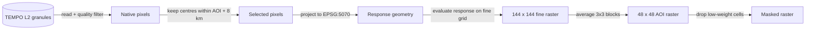

# Regridding TEMPO Level 2 pixels onto AOI rasters

This explains what the regridder does, why it works the way it does, and what
each setting costs you. It assumes no background beyond "TEMPO measures NO2 from
orbit".

## The problem

TEMPO does not report NO2 on a neat grid. It reports one number per *native
pixel*, and a native pixel is a lopsided quadrilateral on the ground whose size
and orientation change with where you are in the scan.

Our model needs the opposite: a fixed 48 by 48 raster covering 72 km around each
power plant, so every cell is 1.5 km across and the same cell means the same
patch of ground in every scan. That last part matters most. We train on the
*change* between two scans an hour apart, so if the grid moved between them the
difference would be mostly grid motion instead of emissions.

Regridding is the step that turns scattered quadrilaterals into that fixed
raster.

## What a native pixel looks like

Each pixel arrives with a centre, four corners, an NO2 column, an uncertainty, a
cloud fraction, and a quality flag. Across the 12 scans in the EDA fixture the
footprints ran 8.8 to 18.6 square km, median 11.1. That is roughly five output
cells' worth of area, and the shape is a skewed quadrilateral rather than a
rectangle.

So one satellite pixel is bigger than one output cell, and the two do not line
up. Every output cell hears from several pixels, and every pixel speaks to
several cells.

## Two honest ways to do this

**Tessellation.** Treat each pixel as a hard polygon. Work out how much of it
overlaps each grid cell, and weight by that overlap area. This is what NASA's
own Level 3 product does. It is fast, it conserves the total, and it assumes the
instrument saw a crisp quadrilateral with nothing outside it.

**Physical oversampling.** Treat each pixel as a soft blob. The instrument did
not sample a sharp rectangle. Its sensitivity peaks at the pixel centre and
fades outward past the footprint edge. Weight each cell by how sensitive the
instrument actually was there. This is the approach from Sun et al. 2018, and
the code adapts the core of POPY v0.4.

We use physical oversampling. The reason is that our signal is a small
plume-scale difference between two scans, and hard polygon edges put artificial
steps into the raster that survive into the difference. A soft response does
not.

The EDA compared the two on identical filtered pixels. They disagree by about
9 percent of a typical column, which is small next to how far both sit from
NASA Level 3 (34 to 43 percent). The choice between them is not what drives the
gap to NASA.

## How the physical response works

For each pixel the code does four things.

1. Project the four corners into EPSG:5070 metres, so distances are in metres
   and not degrees.
2. Build two axes from the footprint: one along the detector array
   (north to south) and one along the mirror step (east to west).
3. Along each axis, define a falloff curve that is 1 at the pixel centre and
   drops to half at the footprint edge. The curve is a super-Gaussian, which is
   a Gaussian with an adjustable exponent. A low exponent gives a soft, bell-like
   blob. A high exponent gives something closer to a box with rounded corners.
4. Evaluate that curve at every grid cell centre. The result is that cell's
   weight for that pixel.

Then each output cell takes the weighted mean of every pixel that reached it.
A cell's value is the sum of `weight x NO2` divided by the sum of `weight`.

The exponents live in `config.py` as `TEMPO_SRF_EXPONENT_XTRACK = 2.0` and
`TEMPO_SRF_EXPONENT_STEP = 3.0`. They control how boxy the blob is on each axis.

### Why we oversample by 3x

Evaluating the response only at the 48 cell centres treats each 1.5 km cell as a
single point, which under-samples a response that varies across the cell. Instead
the code builds the raster on a 144 by 144 grid, then averages each 3 by 3 block
down to one output cell.

The EDA checked this against a 6x grid. Sampling at 1x is off by about 3 percent
of a typical column. Sampling at 3x is off by 0.3 percent. So 3x is converged and
6x buys nothing.

The catch is memory. The current code builds one dense array of every pixel
against every fine cell, which costs about 1.1 MB per native pixel, or a gigabyte
for a well-covered AOI scan. That is the single biggest inefficiency in the
regridder today.

## The settings, and what each one trades

| Setting | Value | What it trades |
|---|---|---|
| `MIN_PIXEL_CLOUD` | 0.20 | Coverage against value accuracy. See below. |
| snow and ice filter | off | Nothing measurable in warm-season scans. |
| `SELECTION_MARGIN_KM` | 8.0 | Runtime against edge accuracy. |
| `OVERSAMPLE_FACTOR` | 3 | Memory and time against integration accuracy. |
| `TEMPO_CELL_WEIGHT_FLOOR` | 0.01 | Cell count against cell reliability. |
| `SRF_MIN_WEIGHT` | 1e-3 | Only affects the reported pixel count per cell. |

### Cloud threshold

This is the largest lever in the whole regridder, and it is a science decision
rather than a numerical one.

At a 0.10 threshold, cloudy AOIs kept 114 and 180 pixels and filled under half
their cells. At 0.20 the same AOIs kept 251 and 450 pixels and filled about three
quarters. On clear days the threshold changes nothing at all.

The cost is that the values move a lot: over 100 percent of a typical column in
those two cloudy AOIs, and 10 to 75 percent elsewhere. More pixels, but the extra
pixels are the ones the retrieval is least sure about.

We use 0.20. Losing half the cells on cloudy days would bias the training set
toward clear weather, and the model needs to see cloudy hours too.

### Snow and ice

Ignored. The filter exists in `read_granule_pixels` and stays off. Across the 12
EDA scans it removed at most 27 pixels from one AOI and moved that raster by 2.5
percent. All 12 fixture scans are from the warm season, so this is a decision to
revisit if the training set ever leans on winter.

### Selection margin

A pixel whose centre sits just outside the AOI still spills weight into cells
near the edge, so the code keeps pixels within 8 km of the grid.

The EDA settled this. Against a generous 32 km reference, using no margin at all
costs 5 to 17 percent, and 8 km is exact to the printed precision. Even 4 km is
already fine. 8 km stays.

## Which cells are trustworthy

Not every cell in the raster deserves to be used. A cell at the edge of a scan
might have caught the faint tail of one distant pixel. Its value is a number, but
it is not a measurement.

The regridder tracks two things per cell.

**Total weight.** The sum of every pixel response that reached the cell. Cells
below `TEMPO_CELL_WEIGHT_FLOOR` are marked unobserved.

**Effective sample size.** Written as `(sum of weight)^2 / (sum of weight^2)`.
It answers "how many independent pixels is this cell really worth". If one pixel
carries all the weight it is 1. If four pixels contribute equally it is 4. A cell
fed by twenty pixels where one dominates still scores near 1.

Across the fixture scans, effective sample size runs a median of 1.82 and a max
of 4.69. A typical cell is worth about two pixels.

### What the floor costs

Over 250 AOI scans and 576,000 cells:

| Weight floor | Cells kept |
|---|---|
| 0.01 (current) | 74% |
| 0.05 | 70% |
| 0.10 | 37% |
| 0.25 | 0% |

The weight histogram shows why the choice between 0.01 and 0.05 barely matters.
84 percent of observed cells sit in a single narrow band near the top of the
range, with a thin tail running six orders of magnitude below it. The floor is
separating a solid cluster from scattered edge dribble, so anything in that
window lands in the same place. Above 0.10 you start cutting into the cluster
itself.

One caveat on the units. Total weight tops out near 0.14, so the 0.01 floor is
about 7 percent of the maximum attainable weight rather than a physical quantity.
Change the response exponents and the floor silently changes meaning.

### Why deltas make masking harder

The training label is the change between two scans an hour apart, so a cell needs
a valid value in *both* rasters. A cell that passes the mask in one scan and
fails in the other produces no delta.

That makes per-raster survival misleading. Requiring an effective sample size of
2 keeps 33 percent of cells in one raster, but the number that matters is the
overlap across the pair, which is smaller. The EDA has not measured it yet.

## What is still open

- **Footprint geometry.** The code builds its response axes from footprint edge
  midpoints. POPY uses a perspective transform of the quadrilateral. The pixel
  centres agree to within a few metres, but the rasters disagree by about 10
  percent of a typical column, and by much more where coverage is thin. Moving
  to the perspective transform is the largest correctness item left.
- **Memory.** The dense pixel-by-cell array should become per-pixel local
  windows.
- **Response exponents.** Fitting them against NASA Level 3 cannot distinguish
  a step exponent of 3 from 4, 6, or 8. They all score within 0.002 of each
  other. Level 3 is itself tessellated, so fitting to it partly fits the
  reference rather than the instrument. The current values stand until an
  instrument-based source settles them.
- **Mask rule.** No weight floor or effective-sample floor has been chosen on
  evidence yet, and the paired-cell survival rate is unmeasured.

The full task list lives in `AGENTS.md`.

## Where the code lives

| File | Role |
|---|---|
| `src/preprocessing/regrid.py` | The production regridder. |
| `src/config.py` | Thresholds and exponents, with units in comments. |
| `src/eda/regrid_eda.py` | The experiment harness behind the numbers here. |
| `scripts/slurm/regrid_eda.sh` | Savio job that produces the EDA report. |

Numbers in this document come from EDA job 38562491, run on 2026-09-04 over 12
fixed AOI scans, plus a 250-scan coverage sample.
